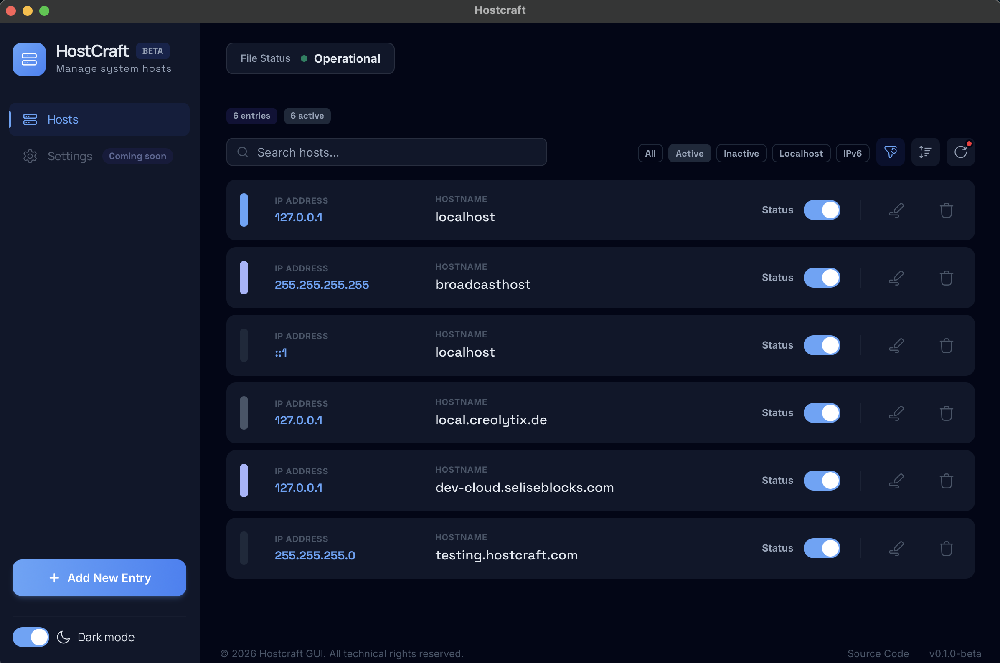
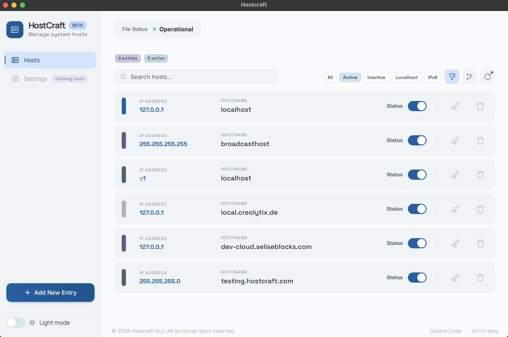

# Hostcraft

[](LICENSE)
[](https://crates.io/crates/hostcraft-cli)
[](https://github.com/Zaberahmed/hostcraft/releases)
[](https://github.com/Zaberahmed/hostcraft/releases)

A suite of tools for managing your system hosts file without ever manually editing it. Hostcraft comes in two forms — a desktop GUI for point-and-click control and a CLI for terminal-first workflows — both powered by the same shared core library.

---

## Ecosystem

| Component | Description | Status | Link |
|---|---|---|---|
| `hostcraft-core` | Shared parsing, data modelling and file I/O library | ✅ Published | [crates.io](https://crates.io/crates/hostcraft-core) |
| `hostcraft-cli` | Terminal interface | ✅ Published | [crates.io](https://crates.io/crates/hostcraft-cli) and [Releases](https://github.com/Zaberahmed/hostcraft/releases/tag/cli-v2.1.1) |
| `hostcraft-gui` | Desktop GUI (Tauri) | 🟡 Beta | [Releases](https://github.com/Zaberahmed/hostcraft/releases) |

---

## Hostcraft GUI

<p align="center">
  
  &nbsp;
  
</p>

A cross-platform desktop app built with Tauri and React. Browse your host entries in a clean list view, toggle entries on or off with a single click, search and filter by status or address family, and add new entries through a guided form — all in a polished interface with full light and dark theme support.

### Download

Download the installer for your platform from the [latest release](https://github.com/Zaberahmed/hostcraft/releases):

| Platform | Installer |
|---|---|
| macOS | `.dmg` |
| Windows | `.msi` or `.exe` |
| Linux | `.AppImage` or `.deb` or `.rpm` |

---

## Hostcraft CLI

<p align="center">
  
</p>

A fast, cross-platform binary with no external dependencies and no Rust installation required. Download a pre-built binary for your platform or use the one-liner install script.

### Install

**macOS / Linux:**

```sh
curl -fsSL https://raw.githubusercontent.com/Zaberahmed/hostcraft/main/install.sh | sh
```

**Windows (PowerShell):**

```powershell
irm https://raw.githubusercontent.com/Zaberahamed/hostcraft/main/install.ps1 | iex
```

**Via Cargo (Rust users):**

```sh
cargo install hostcraft-cli
```

### Quick Start

```sh
hostcraft list                                          # view all entries
sudo hostcraft add myapp.local 127.0.0.1               # add an entry
sudo hostcraft edit myapp.local --new-ip 10.0.0.1      # edit an entry
sudo hostcraft toggle myapp.local                       # enable / disable
sudo hostcraft remove myapp.local                       # remove permanently
hostcraft update                                        # update to the latest version
```

> **Windows users:** run your terminal as Administrator instead of using `sudo`.

→ See [`cli/README.md`](cli/README.md) for the full command reference, options, permissions guide, install and uninstall docs, and development notes.

---

## Repository Structure

```
hostcraft/
├── assets/      # screenshots and project media
├── core/        # hostcraft-core — shared library consumed by all tools
├── cli/         # hostcraft-cli — the terminal interface
└── gui/         # hostcraft-gui — the desktop application (Tauri + React)
```

**Documentation:**

- [`cli/README.md`](cli/README.md) — full CLI reference: all commands, options, permissions, install/uninstall, and development guide
- [`core/README.md`](core/README.md) — API reference and integration guide for `hostcraft-core`
- [GitHub Releases](https://github.com/Zaberahmed/hostcraft/releases) — GUI installers and CLI pre-built binaries

---

## Contributing

Issues and pull requests are welcome on [GitHub](https://github.com/Zaberahmed/hostcraft). If you find a bug, have a feature request, or want to improve the docs, feel free to open an issue.

If you find the project useful, leaving a ⭐ helps others discover it.

---

## License

MIT — see [LICENSE](LICENSE) for details.
