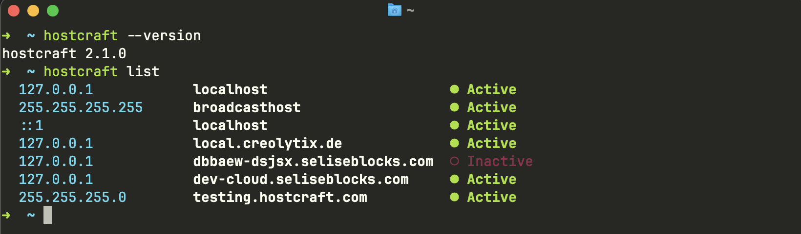

# hostcraft

[](https://crates.io/crates/hostcraft-cli)
[](https://github.com/Zaberahmed/hostcraft/releases?q=cli-v)
[](LICENSE)
[](#installation)

<p align="center">
  
</p>

A fast, cross-platform CLI for managing your system hosts file — add, remove, toggle, edit, and list host entries directly from your terminal without ever manually editing the file.

---

## Ecosystem

| Component | Description | Status | Link |
|---|---|---|---|
| `hostcraft-core` | Shared library | ✅ Published | [crates.io](https://crates.io/crates/hostcraft-core) |
| `hostcraft-cli` | Terminal interface (this crate) | ✅ Published | [crates.io](https://crates.io/crates/hostcraft-cli) |
| `hostcraft-gui` | Desktop GUI (Tauri) | 🟡 Beta | [Releases](https://github.com/Zaberahmed/hostcraft/releases) |

---

## Features

- **List** all host entries with colour-coded active/inactive status
- **Add** a new entry with a hostname and IP address
- **Edit** an existing entry's hostname, IP, or both in a single command
- **Remove** entries by full or partial name match
- **Toggle** entries on/off without deleting them
- **Update** to the latest version with a single command — `hostcraft update`
- Background update checks — once every 24 hours, a notice is printed at the end of any command if a newer version is available
- Entries are never silently lost — disabled entries are preserved as commented-out lines
- Duplicate entry detection — adding the same hostname + IP combination is rejected
- IPv4 and IPv6 support
- Cross-platform — works on macOS, Linux, and Windows
- Coloured, aligned terminal output powered by `anstyle`
- Friendly error messages with platform-specific permission hints

---

## Installation

### macOS / Linux

```sh
curl -fsSL https://raw.githubusercontent.com/Zaberahmed/hostcraft/main/install.sh | sh
```

### Windows (PowerShell)

```powershell
irm https://raw.githubusercontent.com/Zaberahmed/hostcraft/main/install.ps1 | iex
```

### Manual download

Download the archive for your platform from the [latest release](https://github.com/Zaberahmed/hostcraft/releases?q=cli-v), extract it, and move the binary to any directory on your `PATH`.

| Platform | File |
|---|---|
| macOS (Apple Silicon + Intel) | `hostcraft-universal-apple-darwin.tar.gz` |
| Linux x86_64 | `hostcraft-x86_64-unknown-linux-gnu.tar.gz` |
| Linux ARM64 | `hostcraft-aarch64-unknown-linux-gnu.tar.gz` |
| Windows x86_64 | `hostcraft-x86_64-pc-windows-msvc.zip` |

### Via Cargo (Rust users)

```sh
cargo install hostcraft-cli
```

This compiles the binary from source and places it in `~/.cargo/bin/`, which is on your `PATH` by default after a standard Rust installation.

### Verify

```sh
hostcraft --version
```

---

## Uninstall

### macOS / Linux

```sh
curl -fsSL https://raw.githubusercontent.com/Zaberahmed/hostcraft/main/uninstall.sh | sh
```

### Windows (PowerShell)

```powershell
irm https://raw.githubusercontent.com/Zaberahamed/hostcraft/main/uninstall.ps1 | iex
```

The script removes the binary, cleans up the cache directory, and removes the install location from your `PATH`.

### Via Cargo

```sh
cargo uninstall hostcraft-cli
```

---

## Quick Start

```sh
# See all entries in your hosts file
hostcraft list

# Add a new entry
sudo hostcraft add myapp.local 127.0.0.1

# Edit an existing entry
sudo hostcraft edit myapp.local --new-ip 192.168.1.50

# Disable it temporarily without removing it
sudo hostcraft toggle myapp.local

# Remove it entirely
sudo hostcraft remove myapp.local

# Update to the latest version
hostcraft update
```

> **Windows users:** run your terminal as Administrator instead of using `sudo`.

---

## Commands

### `list`

Prints all entries in your hosts file with colour-coded status.

```sh
hostcraft list
```

**Output:**

```
  127.0.0.1            localhost                      ● Active
  255.255.255.255      broadcasthost                  ● Active
  ::1                  localhost                      ● Active
  127.0.0.1            myapp.local                    ○ Inactive
```

- `●` green — entry is active and in effect
- `○` red/dimmed — entry is inactive (commented out in the hosts file)

---

### `add <hostname> <ip>`

Adds a new active entry. The entry is immediately written to the hosts file.

```sh
sudo hostcraft add myapp.local 127.0.0.1
sudo hostcraft add staging.myapp.com 192.168.1.50
sudo hostcraft add mysite.local ::1          # IPv6
```

Adding a duplicate (same hostname **and** same IP) is rejected with an error — the file is left unchanged.

---

### `edit <hostname>`

Edits an existing entry's IP address, hostname, or both in a single command. Requires an exact hostname match (unlike `remove` and `toggle` which accept partial matches).

```sh
# Change only the IP
sudo hostcraft edit myapp.local --new-ip 192.168.1.50

# Change only the hostname
sudo hostcraft edit myapp.local --new-name myapp.dev

# Change both at once
sudo hostcraft edit myapp.local --new-ip 192.168.1.50 --new-name myapp.dev
```

At least one of `--new-ip` or `--new-name` must be provided. Returns an error if no entry is found with that exact hostname, or if the supplied values are identical to the current ones.

---

### `remove <name>`

Removes all entries whose hostname contains the given string. Supports partial matches.

```sh
# Remove an exact hostname
sudo hostcraft remove myapp.local

# Remove all entries matching a substring
sudo hostcraft remove myapp      # removes myapp.local, myapp.dev, etc.
```

Returns an error if no matching entry is found.

---

### `toggle <name>`

Flips matching entries between active and inactive without removing them. Useful for temporarily disabling a host without losing it.

```sh
sudo hostcraft toggle myapp.local

# Before:   127.0.0.1 myapp.local
# After:  # 127.0.0.1 myapp.local

sudo hostcraft toggle myapp.local

# Before: # 127.0.0.1 myapp.local
# After:    127.0.0.1 myapp.local
```

Supports partial name matching — `hostcraft toggle myapp` toggles all entries whose hostname contains `"myapp"`.

---

### `update`

Checks GitHub for a newer version and updates the binary in place if one is available.

```sh
hostcraft update
```

If already on the latest version:

```
✓ hostcraft is up to date (v2.1.0)
```

If a newer version is found, it downloads the pre-built binary for your platform, replaces the current executable, and confirms:

```
↑ Updating v2.1.0 → v2.2.0 ...
✓ Updated to v2.2.0
```

> **Note:** On macOS/Linux, if hostcraft was installed to a root-owned location like `/usr/local/bin`, run `sudo hostcraft update`.

> **Passive notices:** hostcraft also checks for updates silently in the background once every 24 hours. If a newer version is found, a notice is printed at the end of whatever command you ran:
>
> ```
> ↑ Update available: v2.1.0 → v2.2.0
>   Run `hostcraft update` to install.
> ```
>
> The check runs in a background thread and does not add any latency to your command.

---

## Options

| Flag | Default | Description |
|---|---|---|
| `--file <path>` | Platform default (see below) | Override the hosts file path |
| `--help` | — | Print help for the command or subcommand |
| `--version` | — | Print the installed version |

### Default hosts file path

| Platform | Path |
|---|---|
| macOS / Linux | `/etc/hosts` |
| Windows | `C:\Windows\System32\drivers\etc\hosts` |

### Overriding the path

The `--file` flag is useful for testing against a copy without touching your real hosts file:

```sh
hostcraft --file ./hosts-copy list
hostcraft --file ./hosts-copy add myapp.local 127.0.0.1
```

> **Note:** `--file` must come **before** the subcommand.
>
> ```sh
> ✅  hostcraft --file ./hosts-copy list
> ❌  hostcraft list --file ./hosts-copy
> ```

---

## Permissions

Writing to the system hosts file requires elevated privileges on all platforms.

### macOS / Linux

Prefix write commands with `sudo`:

```sh
sudo hostcraft add myapp.local 127.0.0.1
sudo hostcraft edit myapp.local --new-ip 192.168.1.50
sudo hostcraft remove myapp.local
sudo hostcraft toggle myapp.local
```

`list` does **not** require `sudo`:

```sh
hostcraft list
```

### Windows

Run your terminal (Command Prompt or PowerShell) **as Administrator**, then use `hostcraft` normally without any prefix:

```sh
hostcraft add myapp.local 127.0.0.1
hostcraft edit myapp.local --new-ip 192.168.1.50
hostcraft remove myapp.local
hostcraft toggle myapp.local
```

If you forget, hostcraft will tell you:

```
✗ Error: Permission denied: run as Administrator to modify 'C:\Windows\System32\drivers\etc\hosts'
```

---

## Development

### Prerequisites

- [Rust](https://rustup.rs/) (2024 edition or later)

### Build from source

```sh
git clone https://github.com/Zaberahmed/hostcraft.git
cd hostcraft

# Build the entire workspace
cargo build

# Run directly without installing
cargo run --bin hostcraft -- list
cargo run --bin hostcraft -- add myapp.local 127.0.0.1
cargo run --bin hostcraft -- --file ./cli/hosts-copy list
```

### Reinstalling after changes

If you've installed via `cargo install` and made local changes, reinstall to pick them up:

```sh
cargo install --path cli --force
```

### Project structure

```
hostcraft/
├── core/                  # hostcraft-core — shared library
│   └── src/
│       ├── host/          # HostEntry, HostStatus, HostError + operations
│       │   ├── mod.rs     # Public API: parse_contents, add_entry, remove_entry, toggle_entry, edit_entry
│       │   └── utils.rs   # Internal helpers
│       └── file/          # File I/O
│           ├── mod.rs     # Public API: read_file, write_file
│           └── utils.rs   # Internal: write_entries
│
└── cli/                   # hostcraft-cli — this crate
    └── src/
        ├── main.rs           # Entry point — parses args, wires background update check
        ├── command/
        │   └── mod.rs        # CLI definition (Cli, Command) + run() dispatch
        ├── display/
        │   ├── mod.rs        # Coloured output — all print functions
        │   └── style.rs      # ANSI style constants
        └── update/
            ├── mod.rs        # Update logic — public API and command handler
            └── utils.rs      # GitHub API, platform detection, binary download + self-replace
```

### Running tests

```sh
# Run all tests across the workspace
cargo test

# Run only core library tests
cargo test -p hostcraft-core
```

---

## License

MIT — see [LICENSE](LICENSE) for details.